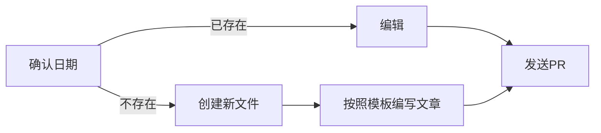

# 文章归档

你可以通过[PR](https://github.com/Over-Run/blog/pulls)来发布文章。  

[返回主页](https://over-run.github.io/)。

## 发布文章的流程



以下是文章的模板。请根据自身情况修改。  
**不按照模板编写的文章将被退回。**  
**注意：日期中月、日统一使用两位数字表示。**  
日期格式：年.月.日

```markdown
# 发布日期: 标题

> Updated: 最后更新日期
>
> Author: 作者用户名（有多名作者时使用复数形式Authors）

正文内容。

```

---

- 2021年  
  [09.28](2021/09-28/)  
  [10.11](2021/10-11/)  
  [12.01](2021/12-01)
